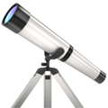

&nbsp;&nbsp;&nbsp;&nbsp;
 

 

    I am a Student who aspires to live a peaceful in the near future, I am a student. I'm active on an app called <strong> <a href="https://discord.com">Discord</a></strong>

  

-  I’m currently working on **Mathematics, Educational stuff, Machine Learning, AI**

-  I'm currently learning **how to top cbse exams**

-  I’m looking for help with **cbse hax**

-  Ask me about **WebDev, css, frontend dev**

-  How to reach me **thedeadstariii (on <a href="https://discord.com/" target="_blank">discord </a>)**

-  Fun fact **I left prgoramming because it is a rat race/herding**

<h3 align="left">Languages & Tools</h3>

                                   

&nbsp;

